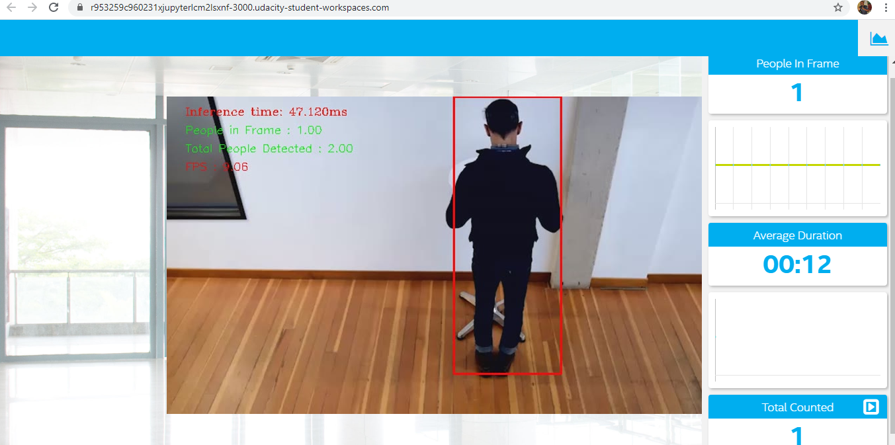

# Deploy a People Counter App at the Edge

| Details            |              |
|-----------------------|---------------|
| Programming Language: |  Python 3.5 or 3.6 |


## What it Does

The people counter application will demonstrate how to create a smart video IoT solution using Intel® hardware and software tools. The app will detect people in a designated area, providing the number of people in the frame, average duration of people in frame, and total count.

People counting applications can be used in a retail store, supermarket, shopping malls, metro station, airport. For example, Once a person is detected, We can follow the object through a shopping pipeline in a retail setting or track and collate behavior i.e customer traffic patterns and time spent at merchandising location.

## How it Works

The counter will use the Inference Engine included in the Intel® Distribution of OpenVINO™ Toolkit. The model used should be able to identify people in a video frame. The app should count the number of people in the current frame, the duration that a person is in the frame (time elapsed between entering and exiting a frame) and the total count of people. It then sends the data to a local web server using the Paho MQTT Python package.

You will choose a model to use and convert it with the Model Optimizer.


## Requirements

### Hardware

* 6th to 10th generation Intel® Core™ processor with Iris® Pro graphics or Intel® HD Graphics.
* OR use of Intel® Neural Compute Stick 2 (NCS2)
* OR Udacity classroom workspace for the related course

### Software

*   Intel® Distribution of OpenVINO™ toolkit 2019 R3 release
*   Node v6.17.1
*   Npm v3.10.10
*   CMake
*   MQTT Mosca server
  
        
## Setup

### Install Intel® Distribution of OpenVINO™ toolkit

Utilize the classroom workspace, or refer to the relevant instructions for your operating system for this step.

- [Linux/Ubuntu](./linux-setup.md)
- [Mac](./mac-setup.md)
- [Windows](./windows-setup.md)

### Install Nodejs and its dependencies

Utilize the classroom workspace, or refer to the relevant instructions for your operating system for this step.

- [Linux/Ubuntu](./linux-setup.md)
- [Mac](./mac-setup.md)
- [Windows](./windows-setup.md)

### Install npm

There are three components that need to be running in separate terminals for this application to work:

-   MQTT Mosca server 
-   Node.js* Web server
-   FFmpeg server
     
From the main directory:

* For MQTT/Mosca server:
   ```
   cd webservice/server
   npm install
   ```

* For Web server:
  ```
  cd ../ui
  npm install
  ```
  **Note:** If any configuration errors occur in mosca server or Web server while using **npm install**, use the below commands:
   ```
   sudo npm install npm -g 
   rm -rf node_modules
   npm cache clean
   npm config set registry "http://registry.npmjs.org"
   npm install
   ```

## Model Selection

We need to find a model not already converted to Intermediate Representation format (i.e. not one of the Intel® Pre-Trained Models), convert it, and utilize the converted model in your application. we use here `ssdlite_mobilenet_v2_coco_2018_05_09` and `faster_rcnn_inception_v2_coco_2018_01_28`.For comparing the models check [WRITEUP](./WRITEUP.md)

  *  Download the model:
```
wget http://download.tensorflow.org/models/object_detection/ssdlite_mobilenet_v2_coco_2018_05_09.tar.gz
```
 *  Unpack it:
```
tar -xvf ssdlite_mobilenet_v2_coco_2018_05_09.tar.gz
```
 *  Convert it:
```
python /opt/intel/openvino/deployment_tools/model_optimizer/mo.py --input_model frozen_inference_graph.pb --tensorflow_object_detection_api_pipeline_config pipeline.config --reverse_input_channels --tensorflow_use_custom_operations_config /opt/intel/openvino/deployment_tools/model_optimizer/extensions/front/tf/ssd_v2_support.json
```
 **Note:** before converting, Change the directory to the extracted folder of the downloaded model ` cd ssdlite_mobilenet_v2_coco_2018_05_09`

## Run the application

From the main directory:

### Step 1 - Start the Mosca server

```
cd webservice/server/node-server
node ./server.js
```

You should see the following message, if successful:
```
Mosca server started.
```

### Step 2 - Start the GUI

Open new terminal and run below commands.
```
cd webservice/ui
npm run dev
```

You should see the following message in the terminal.
```
webpack: Compiled successfully
```

### Step 3 - FFmpeg Server

Open new terminal and run the below commands.
```
sudo ffserver -f ./ffmpeg/server.conf
```

### Step 4 - Run the code

Open a new terminal to run the code. 

You must configure the environment to use the Intel® Distribution of OpenVINO™ toolkit one time per session by running the following command:
```
source /opt/intel/openvino/bin/setupvars.sh -pyver 3.5
```
Then run the command below:
```
python main.py -i resources/Pedestrian_Detect_2_1_1.mp4 -m ssdlite_mobilenet_v2_coco_2018_05_09/frozen_inference_graph.xml -l /opt/intel/openvino/deployment_tools/inference_engine/lib/intel64/libcpu_extension_sse4.so -d CPU -pt 0.4 | ffmpeg -v warning -f rawvideo -pixel_format bgr24 -video_size 768x432 -framerate 24 -i - http://0.0.0.0:3004/fac.ffm
```
## Screenshots



